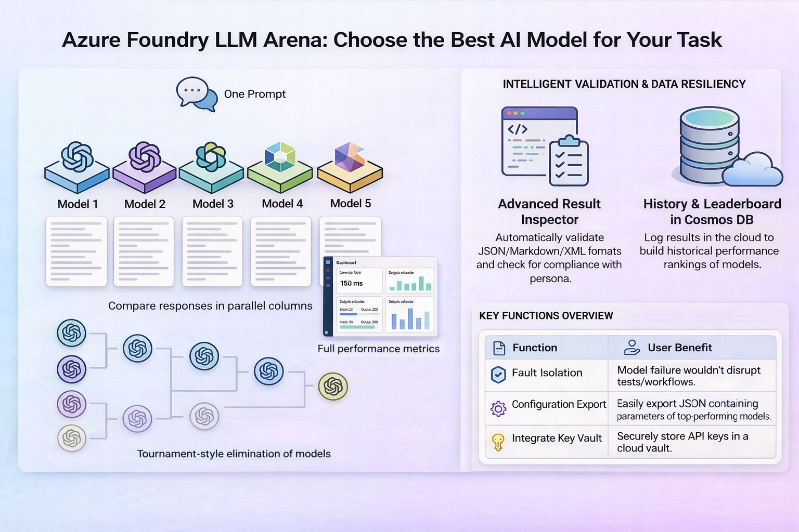
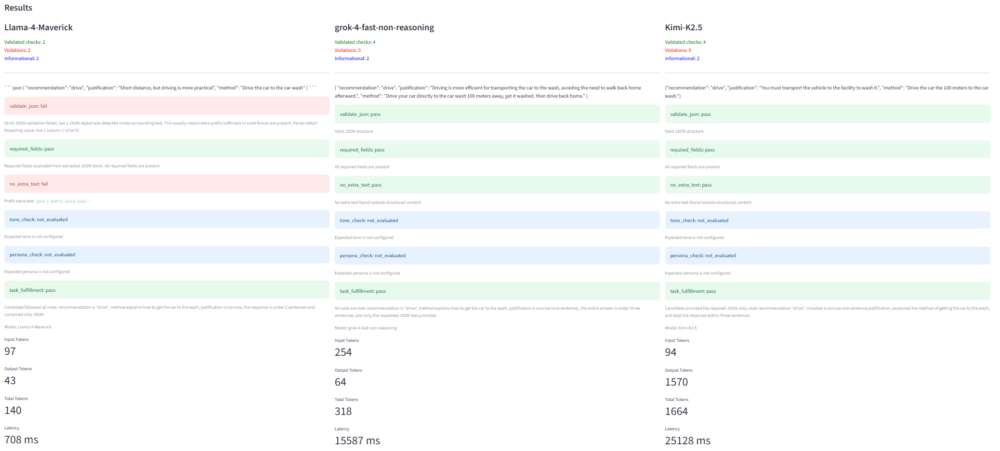
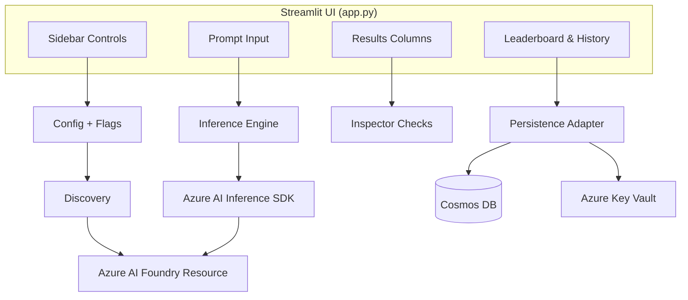
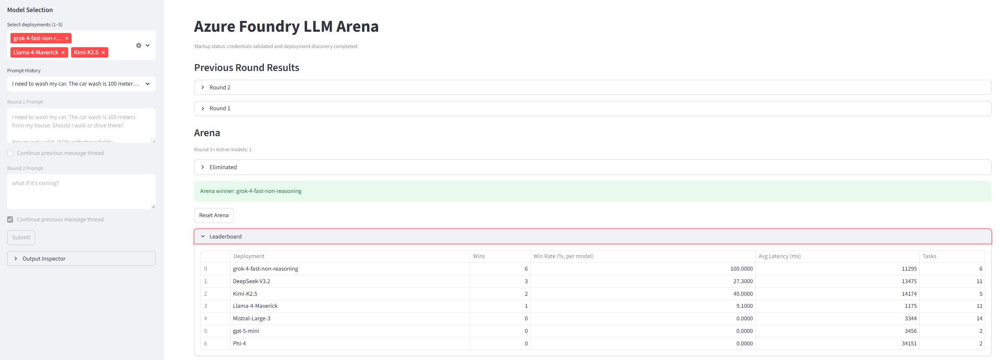

<p align="center">
  
</p>

# Azure Foundry LLM Arena

**Compare multiple Azure AI Foundry model deployments side by side — pick the best model based on actual output, not benchmarks.**

Azure Foundry LLM Arena sends the same prompt to up to five models simultaneously, displays responses with latency and token metrics, validates outputs against configurable quality checks, and runs multi-round elimination tournaments so you can choose a model based on consistency across prompts and real task fit.

Built with Streamlit, Azure AI Inference SDK, Cosmos DB, and Key Vault.

---


## 📼 Demo Video

**▶ [Watch on YouTube](https://youtu.be/BKbiP0_1CU4)**

<video controls src="https://github.com/user-attachments/assets/dc06b902-d799-449f-a7a6-dd00294228f7" title="Grzegorz Wasiak AzureFoundryLLMArena Demo"></video>

> **Sample prompt used in the demo:** *"I need to wash my car. The car wash is 100 meters from my house. Should I walk or drive there?"* — The correct answer is **drive**, because the car itself needs to reach the car wash. The prompt asks models to return valid JSON with `recommendation`, `justification`, and `method` fields, then a follow-up round tests consistency with *"What if it's raining?"*

---

## Key Features

| Feature | Description |
|---|---|
| **Side-by-side comparison** | Send one prompt to 1–5 deployments, see responses in parallel columns |
| **Arena elimination** | Tournament-style rounds — select winners, eliminate losers, converge on the best model |
| **Output Inspector** | Validate JSON/Markdown/XML structure, required fields, extra-text detection, tone and persona checks |
| **Metrics panel** | Per-model latency (ms) and token usage (input/output/total) alongside every response |
| **Cosmos DB persistence** | Store arena results, build a historical leaderboard, track model performance over time |
| **Prompt memory** | Reuse previous prompts from history (Cosmos-backed or local JSON fallback) |
| **Key Vault integration** | Optionally load secrets from Azure Key Vault instead of `.env` |
| **Export** | Download the best model's configuration as a reusable JSON file (no secrets included) |
| **Failure isolation** | One model failure never blocks others — errors display inline per deployment |

### Side-by-side Results



---

## Architecture



---

## Prerequisites

- **Python 3.11+**
- An **Azure AI Foundry** resource with at least one model deployment
- API key for the resource
- *(Optional)* Azure Cosmos DB account — for persistence and leaderboard
- *(Optional)* Azure Key Vault — for secret management

## Quickstart

```bash
# 1. Clone and enter the repo
git clone https://github.com/wasiakgrzes/AzureFoundryLLMArena.git
cd AzureFoundryLLMArena

# 2. Create virtual environment
python -m venv .venv
# Windows
.venv\Scripts\activate
# Linux / macOS
source .venv/bin/activate

# 3. Install dependencies
pip install -r requirements.txt

# 4. Configure credentials (create a .env file or export vars)
cp .env.example .env   # then edit with your values

# 5. Run
streamlit run src/app.py
```

### Minimum `.env`

```env
AZURE_FOUNDRY_ENDPOINT=https://<your-foundry-resource>.services.ai.azure.com
AZURE_FOUNDRY_API_KEY=<your-api-key>
```

For inference endpoints that don't expose a deployment-listing API, specify deployments explicitly:

```env
AZURE_FOUNDRY_DEPLOYMENTS=DeepSeek-V3.2,gpt-5-mini,Mistral-Large-3
```

---

## Configuration Reference

### Core

| Variable | Required | Description |
|---|---|---|
| `AZURE_FOUNDRY_ENDPOINT` | Yes | Foundry resource endpoint URL |
| `AZURE_FOUNDRY_API_KEY` | Yes | API key for the resource |
| `AZURE_FOUNDRY_DEPLOYMENTS` | No | Comma-separated deployment names (fallback when auto-discovery unavailable) |

### Feature Flags

All flags default to `false`. Set to `true` to enable.

| Flag | Category | Description |
|---|---|---|
| `FEATURE_ARENA_ELIMINATION` | Arena | Tournament-style multi-round elimination |
| `FEATURE_ARENA_METRICS_PANEL` | Arena | Show latency and token usage per model |
| `FEATURE_ARENA_LEADERBOARD` | Persistence | Historical win-rate leaderboard (requires Cosmos) |
| `FEATURE_INSPECTOR_ENABLED` | Inspector | Enable the Output Inspector sidebar panel |
| `FEATURE_INSPECTOR_VALIDATE_JSON` | Inspector | JSON structure validation |
| `FEATURE_INSPECTOR_VALIDATE_MARKDOWN` | Inspector | Markdown structure validation |
| `FEATURE_INSPECTOR_VALIDATE_XML` | Inspector | XML structure validation |
| `FEATURE_INSPECTOR_REQUIRED_FIELDS` | Inspector | Check for required top-level JSON keys |
| `FEATURE_INSPECTOR_NO_EXTRA_TEXT` | Inspector | Detect text outside the structured block |
| `FEATURE_INSPECTOR_TONE_CHECK` | Inspector | Model-assisted tone adherence check |
| `FEATURE_INSPECTOR_PERSONA_CHECK` | Inspector | Model-assisted persona adherence check |
| `FEATURE_INSPECTOR_HIGHLIGHTING` | Inspector | Color-coded inspector badges on result cards |
| `FEATURE_CONNECTION_STATUS_PANEL` | UI | Show connection health in the sidebar |
| `FEATURE_PERSISTENCE_COSMOS` | Persistence | Persist arena results to Cosmos DB |
| `FEATURE_PROMPT_MEMORY_ENABLED` | Persistence | Enable prompt history / reuse |
| `FEATURE_KEYVAULT_ENABLED` | Security | Load secrets from Azure Key Vault |
| `PERSIST_PROMPT_TEXT` | Persistence | Store raw prompt text in Cosmos records |

### Cosmos DB (when `FEATURE_PERSISTENCE_COSMOS=true`)

| Variable | Default | Description |
|---|---|---|
| `COSMOS_ENDPOINT` | *(required)* | Cosmos DB account endpoint |
| `COSMOS_ACCOUNT_KEY` | — | Account key (or use Managed Identity) |
| `COSMOS_DATABASE_NAME` | `llm_arena` | Target database name |
| `COSMOS_CONTAINER_NAME` | `arena_results` | Target container name |

### Key Vault (when `FEATURE_KEYVAULT_ENABLED=true`)

| Variable | Description |
|---|---|
| `KEYVAULT_URL` | Key Vault URL (e.g. `https://<vault>.vault.azure.net/`) |

---

## Usage

### Basic Comparison

1. Launch the app with `streamlit run src/app.py`.
2. Select 1–5 deployments in the sidebar.
3. Enter your prompt and click **Submit**.
4. Compare raw outputs, latency, and token metrics side by side.
5. Select the best model and download `best_model_config.json`.

### Arena Elimination Mode

Enable with `FEATURE_ARENA_ELIMINATION=true`.

1. Select 2–5 deployments and submit a prompt.
2. Review round results — check the winner(s) for each successful response.
3. Click **Proceed to Next Round** to eliminate unselected models and pose a follow-up prompt.
4. Repeat until one model remains — the winner banner appears automatically.
5. **Reset Arena** restarts the tournament at any time.

### Output Inspector

Enable with `FEATURE_INSPECTOR_ENABLED=true` plus desired check flags.

1. Open **Output Inspector** in the sidebar.
2. Select a validation format (`json`, `markdown`, or `xml`).
3. Configure required fields, no-extra-text detection, expected tone/persona, or custom instructions.
4. Submit a prompt — per-model check badges appear alongside results.

Inspector checks include:
- **Structural** (local): JSON/Markdown/XML parsing.
- **Required fields** (local): top-level JSON key presence.
- **No extra text** (local): prefix/suffix outside structured block.
- **Semantic** (model-assisted): tone, persona adherence, and custom-instruction compliance with structured reasoning.

### Persistence & Leaderboard

Enable with `FEATURE_PERSISTENCE_COSMOS=true` and optionally `FEATURE_ARENA_LEADERBOARD=true`.

- Arena outcomes are automatically stored in Cosmos DB after each run.
- The leaderboard aggregates wins, win rate, average latency, and task count across all historical runs.
- Prompt memory (`FEATURE_PROMPT_MEMORY_ENABLED=true`) lets you select and re-run previous prompts from a dropdown.



---

## Project Structure

```
src/
  app.py                    # Streamlit UI entry point and orchestration
  config.py                 # Environment variable loading, validation, feature flags
  client.py                 # Azure AI Foundry client initialization
  discovery.py              # Deployment auto-discovery and filtering
  inference.py              # Batch inference execution with failure isolation
  inspector.py              # Output Inspector — structural and semantic checks
  foundry_client_utils.py   # Shared inference client and response helpers
  arena.py                  # Arena state machine (rounds, elimination, winner)
  ui_panels.py              # Extracted UI: results, export, leaderboard, prompt memory
  persistence.py            # Cosmos DB adapter — write/query arena records
  export.py                 # Best-model config JSON generation
tests/
  sanity_checks/            # Per-feature sanity test suites
  fixes/                    # Diagnostic and regression scripts
implementation_plan/        # Incremental build plans (JSON checklists)
prd/                        # Product Requirements Documents
specification/              # Feature specs and user stories
```

---

## Known Limitations

- Single Azure AI Foundry resource per run.
- Cost estimation unavailable — the API does not expose pricing telemetry.
- Parallel fan-out uses threads (not async); throughput depends on local/network limits.
- Markdown and XML structure checks are heuristic-based.
- Semantic inspector checks add latency proportional to number of model responses.
- Arena supports a maximum of 5 selected deployments per run.
- Local-only app — no CI/CD or hosted deployment pipeline.

---

## License

This project is provided as-is for demonstration and evaluation purposes.
